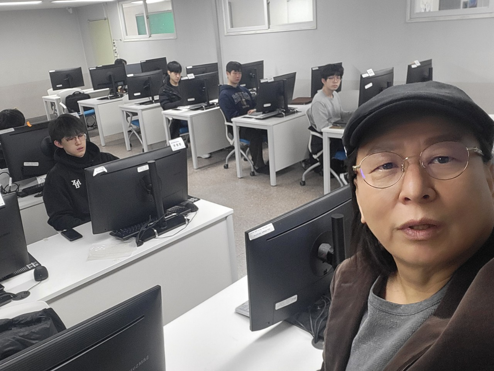
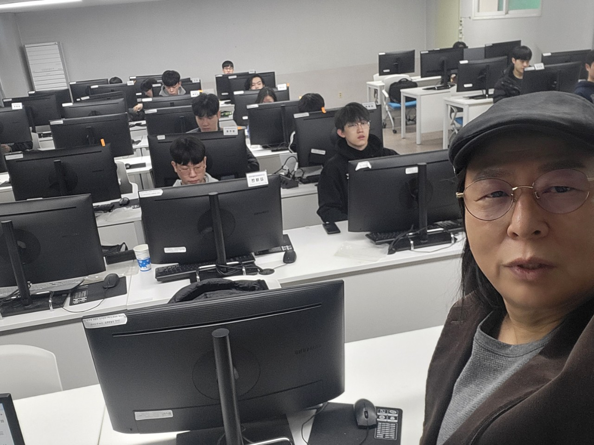

# 2025_AI
## 이 과정은 AI 응용 프로그램을 제작하는 방법을 함께 연구합니다. 
### 명단
1. 정윤우
2. 김태연
3. 정주훈
4. 김태현
5. 김현주
6. 강한솔
7. 강지훈
8. 이수
9. 오민수
10. 김상혁
11. 박상한
12. 이지상
13. 최승균
14. 김기성

### 우리들 사진

### 뱃지 넣는 방법
좋은 아침! 😊 GitHub 프로필에 뱃지를 추가하려면, 
README.md 파일에 마크다운 형식으로 뱃지를 넣으면 돼. 
예를 들어, Shields.io에서 제공하는 뱃지를 사용하면 이렇게 추가할 수 있어:

### 통계 

